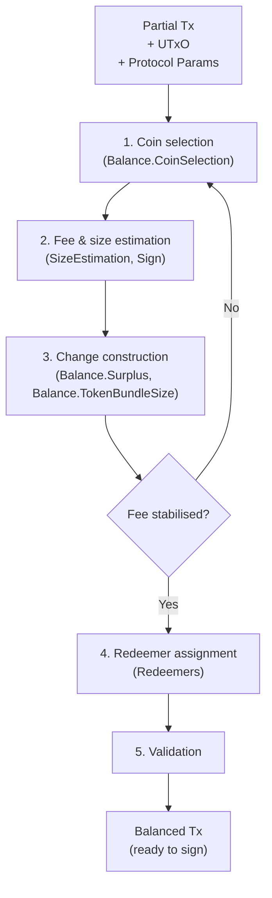

# cardano-balance-tx

[](https://github.com/cardano-foundation/cardano-balance-transaction/actions/workflows/ci.yml)
[](LICENSE)
[](https://cardano-foundation.github.io/cardano-balance-transaction/)

Standalone Cardano transaction balancing library, extracted from
[cardano-wallet](https://github.com/cardano-foundation/cardano-wallet).

## What is this

`cardano-balance-tx` takes a partial Cardano transaction — one with
user-specified outputs but incomplete inputs and fees — and produces a
fully balanced, ready-to-sign transaction. The single public entry point
is `balanceTx` in `Cardano.Balance.Tx.Balance`.

It handles:

- **Coin selection** — choosing UTxO inputs to cover outputs, fees, and
  collateral (via
  [cardano-coin-selection](https://github.com/cardano-foundation/cardano-coin-selection))
- **Fee estimation** — computing minimum fees from estimated transaction
  size and protocol parameters
- **Change output construction** — distributing surplus ada and native
  tokens back to the wallet
- **Surplus distribution** — splitting fee surplus between fee padding
  and change outputs
- **Token bundle size validation** — ensuring outputs don't exceed
  ledger limits
- **Redeemer assignment** — reindexing Plutus script redeemer pointers
  after input selection
- **Transaction size estimation** — predicting serialized size before
  final encoding

The library works directly with `cardano-ledger` types, avoiding any
wallet-specific type abstractions. It targets the two most recent eras
(see [Supported eras](#supported-eras)).

## Architecture

`balanceTx` runs an iterative pipeline. Because adding inputs changes the
transaction size and therefore the fee, the algorithm repeats coin
selection and change construction until the fee stabilises.



See [docs/architecture.md](docs/architecture.md) for the full module
breakdown.

## Supported eras

The library defines a `RecentEra` GADT covering the **two most recent
eras**, so the same code can construct transactions on either side of a
hard fork:

- Conway
- Dijkstra

(Babbage and earlier are modelled as non-recent eras; serialization
round-trip tests still cover Babbage golden fixtures for backwards
compatibility.)

## Install

This is a Haskell library, not an executable. Consume it from another
project by adding it as a `source-repository-package` to your
`cabal.project`:

```cabal
source-repository-package
  type: git
  location: https://github.com/cardano-foundation/cardano-balance-transaction
  tag: <commit-sha>
```

You also need the Cardano Haskell Package repository
([CHaP](https://github.com/IntersectMBO/cardano-haskell-packages)) and a
matching `index-state`; see [cabal.project](cabal.project) for the pins
this repository builds against (GHC 9.12.2).

## Quickstart

```bash
# Clone and enter the Nix devShell (provides GHC, cabal, and CHaP access)
git clone https://github.com/cardano-foundation/cardano-balance-transaction
cd cardano-balance-transaction
nix develop

# Build the library and run the tests via the flake (the CI path)
just build
just unit
```

## Usage

The public surface is a single function. Everything else in
`Cardano.Balance.Tx.Balance` supports calling it (errors, change-address
generation, partial-transaction inputs):

```haskell
balanceTx
    :: forall era m changeState
     . (MonadRandom m, IsRecentEra era)
    => PParams era            -- ^ Protocol parameters
    -> TimeTranslation        -- ^ Slot/time translation for Plutus scripts
    -> UTxOAssumptions        -- ^ Script assumptions for size estimation
    -> UTxOIndex era          -- ^ Available UTxO to select inputs from
    -> ChangeAddressGen changeState
    -> changeState
    -> PartialTx era          -- ^ Transaction to balance
    -> ExceptT (ErrBalanceTx era) m (Tx era, changeState)
```

Exposed modules:

| Module | Description |
|--------|-------------|
| `Cardano.Balance.Tx.Balance` | Main `balanceTx` entry point, error types, `PartialTx`, change-address generation |
| `Cardano.Balance.Tx.Balance.CoinSelection` | Adapter bridging ledger types to `cardano-coin-selection` |
| `Cardano.Balance.Tx.Balance.Surplus` | Surplus distribution between fees and change |
| `Cardano.Balance.Tx.Balance.TokenBundleSize` | Token bundle size assessment |
| `Cardano.Balance.Tx.Eras` | `RecentEra` GADT and constraints (Conway, Dijkstra) |
| `Cardano.Balance.Tx.Gen` | QuickCheck generators for protocol parameters and datum hashes |
| `Cardano.Balance.Tx.Primitive` | Lightweight primitive value types (import qualified as `W`) |
| `Cardano.Balance.Tx.Primitive.Convert` | Conversions between primitive and ledger types |
| `Cardano.Balance.Tx.Primitive.Gen` | QuickCheck generators for primitive types |
| `Cardano.Balance.Tx.Redeemers` | Plutus redeemer index assignment |
| `Cardano.Balance.Tx.Sign` | Signing-related size/fee estimation and witness counting |
| `Cardano.Balance.Tx.SizeEstimation` | Transaction size and cost estimation |
| `Cardano.Balance.Tx.TimeTranslation` | Slot/time translation from epoch info |
| `Cardano.Balance.Tx.Tx` | Transaction/PParams types, serialization, minimum-ada computation |
| `Cardano.Balance.Tx.TxWithUTxO` | Transaction paired with its resolved UTxO |
| `Cardano.Balance.Tx.TxWithUTxO.Gen` | Generators for `TxWithUTxO` |
| `Cardano.Balance.Tx.UTxOAssumptions` | UTxO script assumptions for size estimation |

## Documentation

Full documentation is published at
<https://cardano-foundation.github.io/cardano-balance-transaction/>.

For AI agents, start at [AGENTS.md](AGENTS.md).

## Development

All recipes go through the same flake path used by CI:

```bash
just build        # nix build .#lib .#unit-tests
just unit         # run the unit test suite (optionally: just unit "<match>")
just CI           # build + tests + fourmolu + hlint + nixfmt
just format       # fourmolu, cabal-fmt, nixfmt
just docs-serve   # serve the MkDocs site locally
just docs-build   # mkdocs build --strict
```

Inside `nix develop` you can also drive cabal directly, e.g.
`cabal build lib:cardano-balance-tx -O0` and `cabal test unit -O0`.

## Origin

Extracted from `lib/balance-tx/` in
[cardano-wallet](https://github.com/cardano-foundation/cardano-wallet)
(PR [#5193](https://github.com/cardano-foundation/cardano-wallet/pull/5193)
established the extraction pattern). See [NOTICE](NOTICE) for original
authors and credits.

## License

Apache-2.0 — see [LICENSE](LICENSE).

Copyright 2018-2022 IOHK, 2023-2026 Cardano Foundation.
