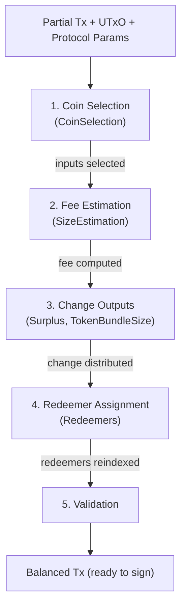
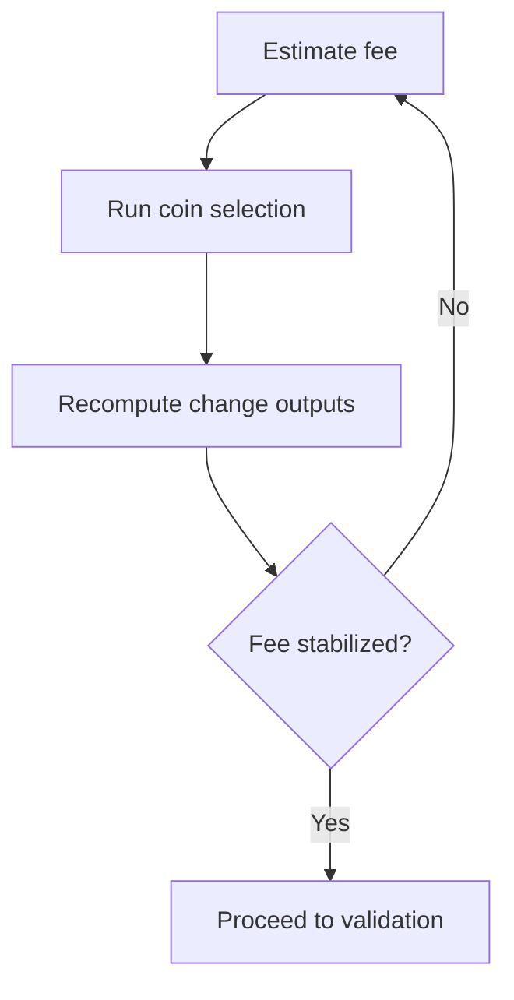
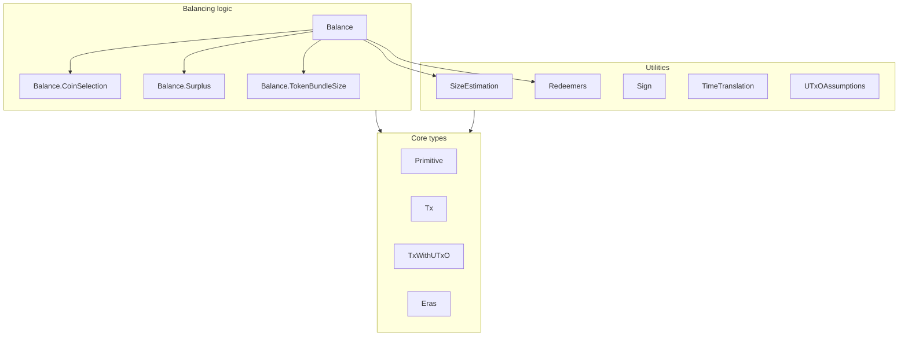

# Architecture

## Balancing pipeline

Transaction balancing transforms a partial transaction (user-specified
outputs, no inputs or fees) into a fully balanced transaction ready for
signing. The core entry point is `balanceTx` in
`Cardano.Balance.Tx.Balance`.

### Pipeline stages

### Iteration

The algorithm must iterate because adding inputs changes the
transaction size and therefore the fee. Each iteration:

1. Estimates the fee for the current transaction
2. Runs coin selection if more inputs are needed
3. Recomputes change outputs
4. Checks if the fee has stabilized

Convergence is guaranteed because each round can only add inputs (never
remove them), and the UTxO set is finite.

## Module organization

The library is organized into three layers:

### Core types

- **`Primitive`** — lightweight value types (coin, token bundle,
  address) inlined from `cardano-wallet-primitive`, bridging to ledger
  types via `Primitive.Convert`
- **`Tx`** — transaction-level types, key witness counting
- **`TxWithUTxO`** — a transaction paired with its resolved UTxO context
- **`Eras`** — era definitions (`RecentEra` covering Babbage/Conway)

### Balancing logic

- **`Balance`** — the main `balanceTx` function and error types
- **`Balance.CoinSelection`** — adapter between ledger types and the
  `cardano-coin-selection` library
- **`Balance.Surplus`** — distributing fee surplus between padding and
  change
- **`Balance.TokenBundleSize`** — assessing whether token bundles fit
  in a single output

### Utilities

- **`SizeEstimation`** — predicting serialized transaction size
- **`Redeemers`** — assigning script redeemer indices
- **`Sign`** — transaction signing
- **`TimeTranslation`** — slot/time conversion from epoch info
- **`UTxOAssumptions`** — assumptions about UTxO script types for size
  estimation

## Era support

The library uses a `RecentEra` GADT to support Babbage and Conway. All
era-specific logic is isolated in `Eras` and pattern-matched where
needed, keeping the core balancing algorithm era-polymorphic.
