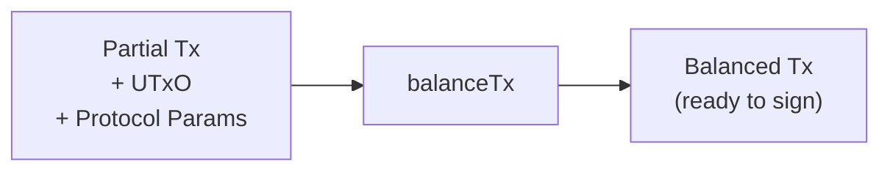

# cardano-balance-tx

Standalone Cardano transaction balancing library.

## What it does

`cardano-balance-tx` takes a partial Cardano transaction — one with
user-specified outputs but incomplete inputs and fees — and produces a
fully balanced, ready-to-sign transaction.

The library handles coin selection, fee estimation, change construction,
surplus distribution, token bundle size validation, Plutus redeemer
assignment, and transaction size estimation across Babbage and Conway
eras.

## Getting started

See the [Getting Started](getting-started.md) guide for build
instructions and Nix setup.

## Documentation

- [Architecture](architecture.md) — how the balancing pipeline works
- [Module Reference](modules.md) — all exposed modules with descriptions
- [Getting Started](getting-started.md) — build, test, and develop

## Links

- [GitHub Repository](https://github.com/cardano-foundation/cardano-balance-transaction)
- [cardano-coin-selection](https://github.com/cardano-foundation/cardano-coin-selection) — coin selection dependency
- [cardano-wallet](https://github.com/cardano-foundation/cardano-wallet) — origin project

## License

Apache-2.0 — Copyright 2018-2022 IOHK, 2023-2026 Cardano Foundation.
